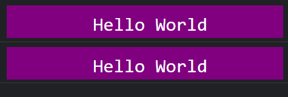
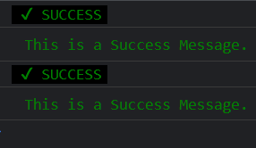
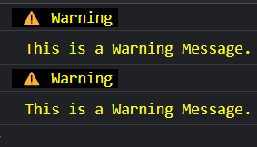
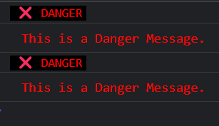

## log-prettify

### Log Output

<strong>

    ```js
        decorator.mod({
            text: "ENTER TEXT",
            fontSize: "ENTER_FONT_SIZE",
            color: "ENTER_FONT_COLOR_IF_REQUIRED",
            backgroundColor: "ENTER_FONT_BACKGROUND_COLOR_IF_REQUIRED",
            margin: "ENTER_MARGIN_HERE_IF_REQUIRED",
            marginTop: "ENTER_MARGIN-TOP_HERE_IF_REQUIRED",
            marginBottom: "ENTER_MARGIN-BOTTOM_HERE_IF_REQUIRED",
            marginLeft: "ENTER_MARGIN-LEFT_HERE_IF_REQUIRED",
            marginRight: "ENTER_MARGIN-RIGHT_HERE_IF_REQUIRED",
            padding: "ENTER_PADDING_HERE_IF_REQUIRED",
            paddingTop: "ENTER_PADDING-TOP_HERE_IF_REQUIRED",
            paddingBottom: "ENTER_PADDING-BOTTOM_HERE_IF_REQUIRED",
            paddingLeft: "ENTER_PADDING-LEFT_HERE_IF_REQUIRED",
            paddingRight: "ENTER_PADDING-RIGHT_HERE_IF_REQUIRED"
        });
    ```

</strong>


### Log Success Message

<strong>

    ```js
        decorator.success("This is a Success Message.");
    ```

</strong>


### Log Warning Message

<strong>

    ```js
        decorator.warn("This is a Warning Message.");
    ```

</strong>


### Log Danger Message

<strong>

    ```js
        decorator.danger("This is a Danger Message.");
    ```

</strong>

